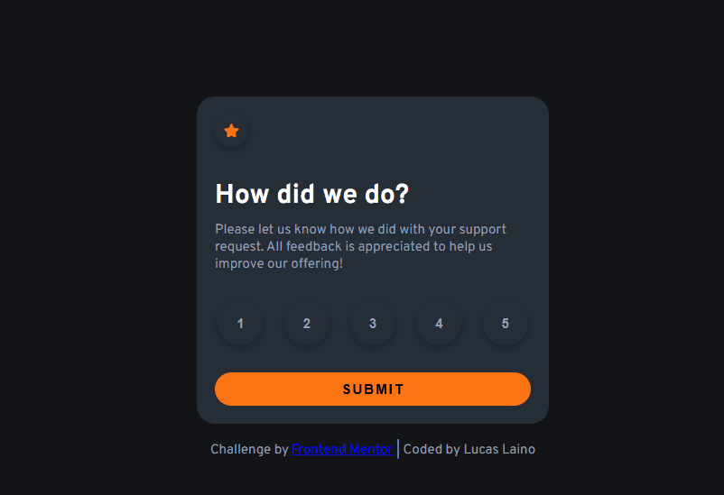

# Frontend Mentor - Interactive Rating Component⚙️

Essa é a solução para o [Interactive Rating Component](https://www.frontendmentor.io/challenges/interactive-rating-component-koxpeBUmI). Os desafios do Frontend Mentor ajudam você a melhorar sua habilidade de codar construindo projetos realisticos.

## Tabela de conteúdos📑

- [Visão Geral](#visão-geral)
  - [O Desafio](#o-desafio)
  - [Screenshot](#screenshot)
  - [Links](#links)
- [Meu processo](#meu-processo)
  - [Construido com](#construido-com)
  - [O que eu aprendi](#o-que-eu-aprendi)
- [Autor](#autor)

## Visão Geral👀

### O Desafio

- O desafio constitui em construir o projeto com os designs fornecidos pelo frontend mentor chegando o mais perto possível do design original. No projeto nós podemos usar qualquer tipo de ferramenta para ajudar a concluir o desafio.

### Screenshot

### Links

- URL do site: [Interactive Rating Component](https://lucaslaino.github.io/frontend-mentor-Interactive-rating-component/)

## Meu processo🚀

### Construído com

- HTML semântico
- CSS
- JavaScript Puro
- [Google Fonts](https://fonts.google.com/)

## Autor🧙🏻

- LikedIn - [@Lucas Laino](https://www.linkedin.com/in/lucaslaino/)
- Frontend Mentor - [@LucasLaino](https://www.frontendmentor.io/profile/LucasLaino)
